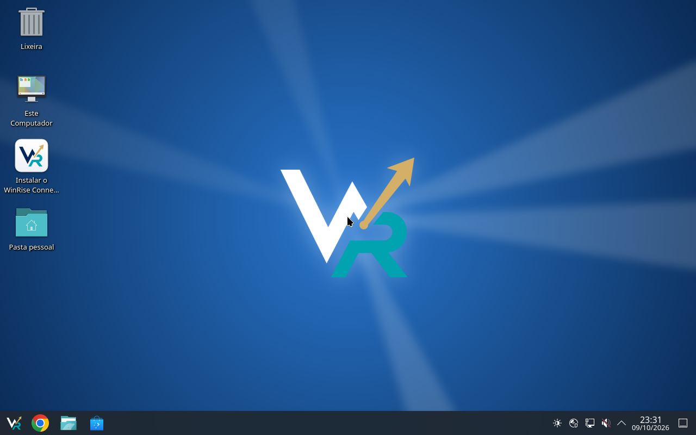
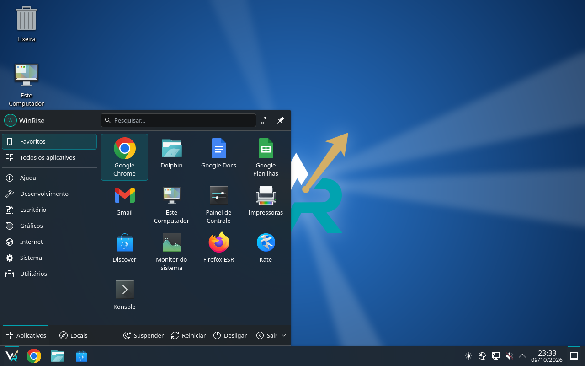
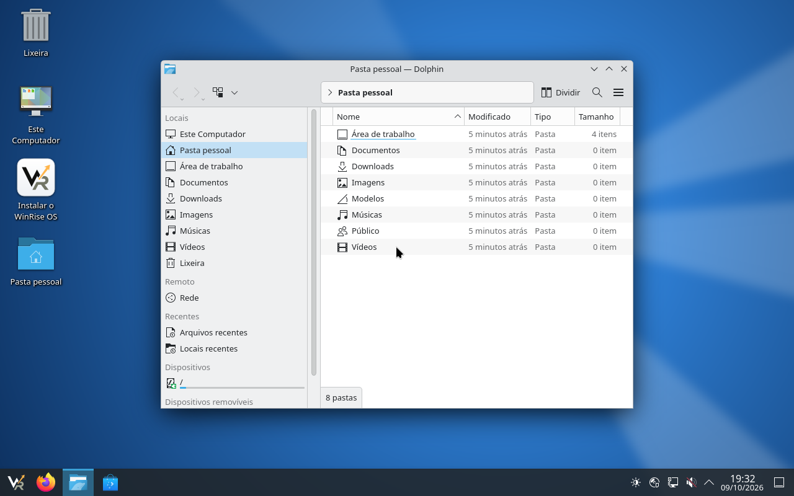
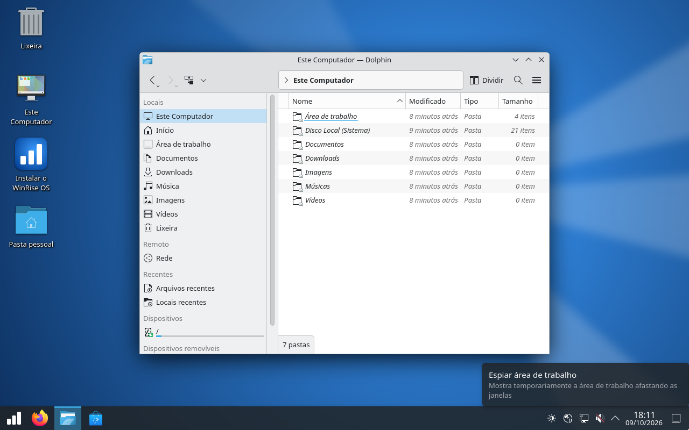
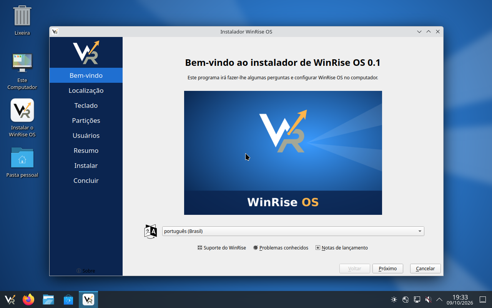
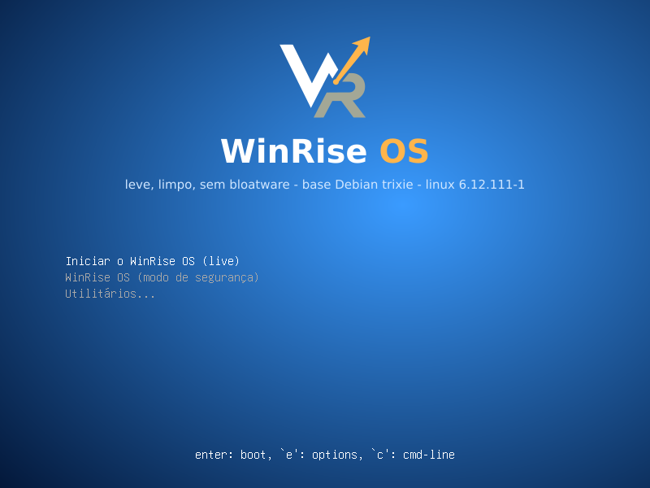
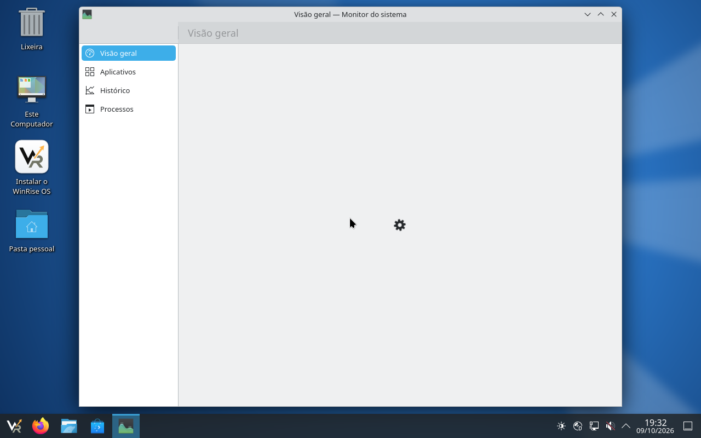

<p align="center">
  <picture>
    <source media="(prefers-color-scheme: dark)" srcset="docs/winrise-lockup-light.png">
    
  </picture>
</p>

# WinRise Connect OS

**Uma distribuição Linux com a cara do Windows 10 — leve, limpa e sem bloatware.**

O WinRise Connect OS é baseado no **Debian 13 (trixie)** com **KDE Plasma 6**, configurado para que
quem vem do Windows se sinta em casa desde o primeiro clique: barra de tarefas embaixo,
menu Iniciar, "Este Computador", Lixeira na área de trabalho, Explorador de Arquivos com
duplo clique e os mesmos atalhos de teclado.



| Menu Iniciar | Explorador de arquivos (Dolphin) | Este Computador |
|---|---|---|
|  |  |  |

| Instalador (Calamares com a identidade WinRise) | Menu de boot (UEFI e BIOS) |
|---|---|
|  |  |

| <kbd>Ctrl</kbd>+<kbd>Shift</kbd>+<kbd>Esc</kbd> abre o Monitor do Sistema |
|---|
|  |

## Filosofia

- **Visual do Windows 10**: barra de tarefas escura e única embaixo, botão Iniciar à esquerda,
  apps fixados, bandeja do sistema e relógio (hora + data) à direita, botão "mostrar área de
  trabalho" no canto, janelas claras com botões minimizar/maximizar/fechar à direita.
- **Leve e limpo**: nada de notícias, clima, widgets, anúncios, "dicas", telemetria ou apps
  empurrados. Usamos o `kde-plasma-desktop` mínimo (não o `kde-standard`/`kde-full`):
  sem PIM/Akonadi, sem jogos, sem KDE Connect, sem tela de boas-vindas, sem Konqueror.
- **Funciona em quase qualquer PC**: kernel Linux do Debian com firmware não-livre incluso
  (Wi-Fi Intel/Realtek/Atheros/Broadcom/MediaTek, GPUs AMD/Intel, áudio SOF), boot por
  **UEFI e BIOS legado** a partir da mesma ISO.
- **Em português do Brasil** por padrão (idioma pt-BR, teclado ABNT2, fuso de São Paulo), com
  inglês disponível.

## Navegação igual ao Windows (o grande diferencial)

| No Windows 10 | No WinRise Connect OS |
|---|---|
| Explorador de Arquivos | **Dolphin** configurado como o Explorer: **duplo clique** para abrir, modo **Detalhes** por padrão (nome, data de modificação, tipo, tamanho), barra lateral com Área de trabalho, Documentos, Downloads, Imagens, Música, Vídeos, Lixeira e **discos/pendrives**, barra de endereço em "migalhas" (clique no espaço vazio dela para digitar o caminho), sem barra de menus |
| Este Computador | Ícone **Este Computador** na área de trabalho e no menu Iniciar: mostra suas pastas, o **Disco Local (Sistema)** e os discos/pendrives montados |
| Lixeira | Ícone **Lixeira** na área de trabalho |
| Pasta do usuário | Ícone **Pasta pessoal** na área de trabalho |
| Pastas do usuário | `Área de trabalho`, `Documentos`, `Downloads`, `Imagens`, `Música`, `Vídeos`, `Modelos`, `Público` já criadas em pt-BR |
| Menu Iniciar | **Kickoff** com campo de busca (é só começar a digitar), apps **fixados** em grade e **todos os apps por categoria** |
| Barra de tarefas | Firefox, Explorador (Dolphin) e Loja (Discover) fixados; só ícones, agrupados por app |
| Botão direito → Novo → Pasta / Documento de texto | **Criar novo → Pasta / Arquivo de texto** na área de trabalho e no Dolphin |
| Instalar `.exe`/`.msi` com duplo clique | Duplo clique em **`.deb`** abre na **Discover** (loja) para instalar; duplo clique em **AppImage** pergunta e executa (como um `.exe` portátil); Flatpak (`.flatpakref`) abre na Discover |
| Microsoft Store | **Discover** (pacotes Debian + Flatpak/Flathub) |

### Atalhos de teclado

| Atalho | Ação |
|---|---|
| <kbd>Win</kbd> | Abre o menu Iniciar |
| <kbd>Win</kbd>+<kbd>E</kbd> | Abre o Explorador de Arquivos (Dolphin) |
| <kbd>Win</kbd>+<kbd>D</kbd> | Mostra a área de trabalho |
| <kbd>Win</kbd>+<kbd>L</kbd> | Bloqueia a tela |
| <kbd>Alt</kbd>+<kbd>Tab</kbd> | Alterna entre janelas (com miniaturas) |
| <kbd>Ctrl</kbd>+<kbd>Shift</kbd>+<kbd>Esc</kbd> | Gerenciador de tarefas (Monitor do Sistema) |
| <kbd>PrtSc</kbd> / <kbd>Win</kbd>+<kbd>Shift</kbd>+<kbd>S</kbd> | Captura de tela / recorte de área (Spectacle) |
| <kbd>Ctrl</kbd>+<kbd>Alt</kbd>+<kbd>T</kbd> | Terminal (Konsole) |
| <kbd>Win</kbd>+<kbd>←</kbd>/<kbd>→</kbd> | Encaixar janela na metade da tela |

## O que vem instalado (só o essencial)

| Função | Programa |
|---|---|
| Área de trabalho | KDE Plasma 6 (mínimo), SDDM, Wayland (X11 disponível) |
| Navegador | **Google Chrome** (padrão, fixado na barra; repositório oficial do Google com atualizações automáticas) e Firefox ESR (pt-BR, configurado para ser mais leve) |
| Escritório | **Google Docs, Planilhas, Apresentações, Gmail e Drive** no menu Iniciar › Escritório (abrem em janela própria pelo Chrome) — sem LibreOffice |
| Arquivos | Dolphin |
| Terminal | Konsole |
| Editor de texto | Kate |
| PDF / Imagens / Compactados / Captura | Okular / Gwenview / Ark / Spectacle |
| Loja de apps | Discover (Debian + Flatpak) |
| Gerenciador de tarefas | Monitor do Sistema |
| Rede / Som / Bluetooth | NetworkManager + applet Wi-Fi do Plasma, wpasupplicant, PipeWire, BlueZ + Bluedevil |
| Impressoras e scanners | CUPS + Gerenciador de impressão do Plasma, drivers HP (HPLIP), Epson (ESC/P-R), Canon e outras (Gutenprint, Foomatic), Samsung/Xerox (SpliX), Brother (brlaser); impressoras de rede/Wi-Fi sem driver (IPP Everywhere/AirPrint via Avahi e ipp-usb); scanners com sane-airscan + Skanlite |
| Máquinas virtuais | qemu-guest-agent, spice-vdagent, open-vm-tools (cada um só ativa no seu hypervisor) |
| Instalador | Calamares |

Removidos de propósito: Plasma Welcome, KDE Connect, Konqueror, KHelpCenter, KWrite,
integração de navegador, jogos, PIM/Akonadi, widgets de clima/notícias.

## Requisitos

- PC **x86_64 (64 bits)** Intel ou AMD com um bom processador
- **8 GB de RAM** ou mais
- 30 GB de disco para instalar
- UEFI (com Secure Boot desligado nesta versão) ou BIOS legado

### Hardware incluído

- **Wi-Fi**: firmware Intel (iwlwifi), Realtek, Atheros/Qualcomm, Broadcom (brcm80211), MediaTek e
  outros (`firmware-misc-nonfree`), além de vídeo AMD/Intel e som Intel (SOF).
- **Impressoras**: na maioria dos casos é só ligar (USB) ou estar na mesma rede Wi-Fi — o CUPS
  encontra impressoras compatíveis com IPP Everywhere/AirPrint sozinho. Para as demais, use
  *Configurações do sistema › Impressoras › Adicionar*.

## Testar no VirtualBox

O VirtualBox não tem aceleração 3D real para Linux, então navegadores ficam mais lentos que no
PC de verdade. Para a melhor experiência:

- **Sistema**: 4 CPUs, **4 a 6 GB de RAM**, *Habilitar EFI* (opcional) e VT-x/AMD-V ativado
  na BIOS do PC (no Windows, desative o Hyper-V/"Plataforma de Máquina Virtual" se o
  VirtualBox ficar muito lento ou mostrar uma tartaruga verde).
- **Tela**: controlador **VMSVGA** (o recomendado para Linux), 128 MB de vídeo. Se a tela ficar
  preta ou travar, teste **VBoxSVGA**. Avisos do kernel como `vmwgfx ... unsupported hypervisor`
  com VMSVGA são inofensivos.
- **Guest Additions**: não estão no Debian 13; o sistema funciona sem elas (redimensionar a tela
  automaticamente e área de transferência compartilhada dependem delas).
- No QEMU/KVM (virt-manager) e no VMware a integração já vem pronta.

## Como gerar a ISO

Num Debian 13 (ou Ubuntu recente) com acesso root, internet e ~20 GB livres:

```bash
git clone https://github.com/wglebioravel/winrise-connect-os.git
cd winrise-connect-os
make deps     # instala live-build, xorriso, qemu etc.
make iso      # gera winrise-connect-os-0.2-amd64.iso (demora 20–60 min)
make run-uefi # ou: make run-bios — testa no QEMU
```

Para recomeçar do zero: `make clean` (mantém o cache de pacotes) ou `make distclean`.

Dicas para máquinas com pouca RAM ou rede instável:

- Limite o `mksquashfs`: `make iso SQUASH_OPTS="-mem 1G -processors 2"`.
- O apt já tenta de novo automaticamente (`Acquire::Retries`) quando o espelho Debian
  devolve erros temporários (500); se ainda assim falhar no fim, rode `make iso` de novo.
- Faça o build num disco local (ex.: `/var/tmp`), fora de pastas sincronizadas.

## Como gravar no pendrive

- **Ventoy** (recomendado): instale o Ventoy no pendrive e só copie o arquivo `.iso` para ele.
- **Rufus** (Windows): selecione a ISO; se perguntar, escolha o modo **DD**.
- **Linux/macOS** (`dd`) — cuidado, apaga o pendrive inteiro:
  ```bash
  sudo dd if=winrise-connect-os-0.2-amd64.iso of=/dev/sdX bs=4M status=progress oflag=sync
  ```

Depois é só dar boot pelo pendrive (F12/F11/F8/Esc no menu de boot do PC). O sistema abre
direto na área de trabalho (usuário live `winrise`, sem senha). Para instalar, use o ícone
**Instalar o WinRise Connect OS** na área de trabalho.

## Estrutura do repositório

```
auto/config                 opções do live-build (Debian trixie, amd64, UEFI+BIOS, pt-BR)
config/package-lists/       lista de pacotes (base, desktop, apps, firmware, instalador)
config/hooks/normal/        remoção de bloatware e identidade visual (os-release, Calamares, SDDM)
config/includes.chroot/     arquivos copiados para o sistema:
  etc/xdg/                  padrões do KDE (tema, Dolphin, atalhos, associações de arquivos)
  etc/skel/                 perfil padrão do usuário (ícones da área de trabalho, pastas pt-BR)
  usr/share/plasma/look-and-feel/org.winrise.desktop/   tema global + layout da barra de tarefas
  usr/share/wallpapers/WinRise/                         papel de parede (arte própria)
  usr/local/bin/            "Este Computador" e executor de AppImage
artwork/                    logo oficial (original JPG, SVG vetorizado, variante clara, favicon)
scripts/make-logo.py        vetoriza o logo oficial (fundo transparente, SVG por camadas de cor)
scripts/make-branding.py    gera ícones, logo do instalador e a tela do menu de boot
scripts/make-wallpaper.sh   gera o papel de parede
```

### Identidade visual

O logo oficial (W azul-marinho, R turquesa e seta dourada subindo, com "WinRise Connect") fica
em `artwork/`: o símbolo sozinho (`winrise-logo.svg`) e o logo completo (`winrise-lockup.svg`).
Em fundos escuros — barra de tarefas, menu de boot, instalador e papel de parede (símbolo
centralizado) — usamos as variantes claras (`*-light.svg`, com o W e o "Win" brancos). A cor de
destaque do tema é o turquesa da marca (#01A3B0). `make branding` regera tudo a partir
de `artwork/winrise-connect-logo-original.jpg`.

## Roteiro

- [x] 0.1 — ISO live com KDE estilo Windows 10, navegação estilo Windows, sem bloatware, instalador Calamares
- [x] 0.2 — novo nome e logo (WinRise Connect OS), Google Chrome + apps Google, impressoras/scanners, integração com VMs
- [ ] Tema de janelas/ícones ainda mais próximo do Windows 10 e telas de boot (GRUB/Plymouth) próprias
- [ ] Central de boas-vindas mínima e opcional (sem propaganda) com drivers NVIDIA em 1 clique
- [ ] Secure Boot assinado
- [ ] Busca de arquivos no menu Iniciar com indexação leve
- [ ] Atualizações automáticas silenciosas e opção de compatibilidade com apps Windows (Wine/Bottles)
- [ ] Repositório próprio de pacotes `winrise-*` e builds automáticos (GitHub Actions)

## Licença

[MIT](LICENSE) para os scripts e configurações deste repositório. Os pacotes do Debian/KDE
mantêm suas próprias licenças. WinRise Connect OS não é afiliado à Microsoft; "Windows" é marca da
Microsoft Corporation e é citado apenas como referência de usabilidade.
